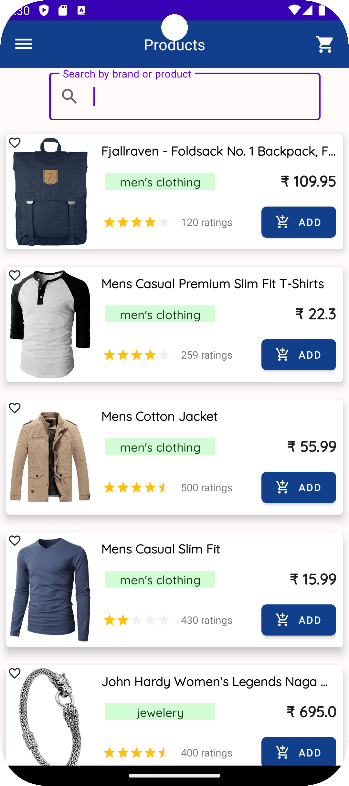

# MyE-Kart Products Screen

The Products Screen in the app serves as the central hub for users to explore and interact with the diverse range of products available. The key features of this screen include:

---

## Features

- **Product List**: A dynamic list showcasing all available products with essential details such as name, price, and a brief description.
- **Search Functionality**: An integrated search bar at the top allows users to quickly find specific products by typing keywords.
- **Filter Options**: Users can filter the product list based on categories, price range, popularity, and more to narrow down their choices.
- **Product Details**: Each product item in the list can be tapped to view more detailed information, including images, full descriptions, customer reviews, and additional specifications.
- **Add to Cart**: A prominent button on each product detail page enables users to easily add items to their shopping cart.
- **User Reviews and Ratings**: Display user-generated reviews and ratings for each product, helping potential buyers make informed decisions.
- **Favorites**: Users can mark products as favorites to quickly access them later.
- **Responsive Design**: The layout is designed to work seamlessly on different devices and screen sizes, ensuring a consistent and user-friendly experience.

The **Products Screen** is designed to be intuitive, user-friendly, and visually appealing, ensuring a smooth and engaging shopping experience for users.

---

## Installation

1. Clone the repo
    ```sh
    git clone https://github.com/Vino92/MyE-Kart.git
    ```
2. Open the project in Android Studio.
3. Build the project.

## Usage



## License

Distributed under the MIT License. See `LICENSE.txt` for more information.

## Contact

Your Name - VINOTH (https://www.linkedin.com/in/vinoth92) - s.vinoth7392@gmail.com

Project Link: [MyE-Kart](https://github.com/Vino92/MyE-Kart)
